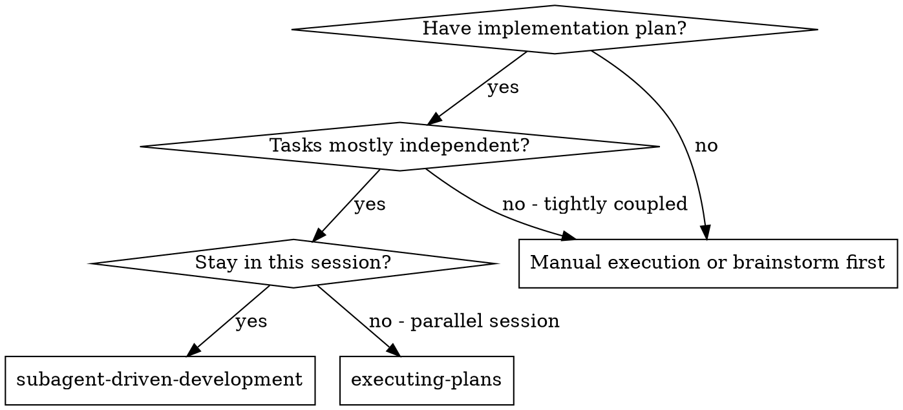
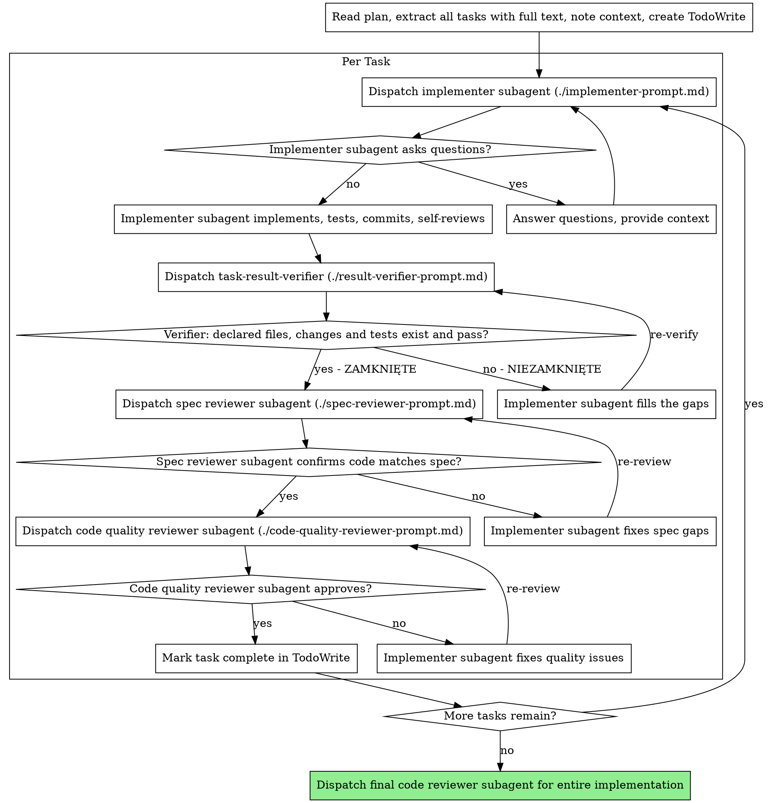

# Subagent-Driven Development

Execute plan by dispatching fresh subagent per task, with a mechanical result check and a two-stage review after each: result verification first (`task-result-verifier`), then spec compliance review, then code quality review.

**Why subagents:** You delegate tasks to specialized agents with isolated context. By precisely crafting their instructions and context, you ensure they stay focused and succeed at their task. They should never inherit your session's context or history — you construct exactly what they need. This also preserves your own context for coordination work.

**Core principle:** Fresh subagent per task + mechanical result check + two-stage review (spec then quality) = high quality, fast iteration

## Implementer Boundaries (CCOS rule)

The implementer subagent writes code **only within the scope the controller (main session) assigned**. It never merges, never pushes to a remote, never widens scope, and never approves its own work — its "DONE" is a claim to be checked, not a result. It may commit locally in its own branch or worktree, because reviewers need a diff to inspect. Accepting the result, integrating it, verifying it with real commands, and deciding what happens next belong **only** to the controller.

**Isolation:** in one working directory only one subagent writes at a time. Parallel writing is allowed **only** in separate git worktrees (e.g. `isolation: worktree` on the subagent). Reviewers and verifiers never write: they get no edit tools, and where they keep a terminal (the result verifier runs tests) their instructions limit it to read-only git and test commands.

**Continuous execution:** Do not pause to check in with your human partner between tasks. Execute all tasks from the plan without stopping. The only reasons to stop are: BLOCKED status you cannot resolve, ambiguity that genuinely prevents progress, or all tasks complete. "Should I continue?" prompts and progress summaries waste their time — they asked you to execute the plan, so execute it.

## When to Use



**vs. Executing Plans (parallel session):**
- Same session (no context switch)
- Fresh subagent per task (no context pollution)
- Two-stage review after each task: spec compliance first, then code quality
- Faster iteration (no human-in-loop between tasks)

## The Process



## Before Dispatch: Context Check (CCOS rule)

Before dispatching any subagent, the controller checks that the task text contains all four:

1. **Goal** - what "done" looks like, in one or two sentences
2. **Files** - which files to create or change (and which not to touch)
3. **Constraints** - scope limits, patterns to follow, what is out of scope
4. **Verification** - the exact commands or checks that prove the task works

For every missing item, the controller fills the gap itself with targeted search (Grep, Glob, Read of the specific files) - **at most three search passes** in total per task. It does not dispatch a subagent to go find its own context.

If something is still missing after three passes: do not dispatch. Ask your human partner the specific question, or mark the task as blocked in TodoWrite and move to the next independent task. A subagent dispatched with a gap will guess, and a guess costs a full review loop.

## Model Selection

Use the least powerful model that can handle each role to conserve cost and increase speed. Pass the `model` parameter explicitly on every dispatch (Task/Agent tool call) — it overrides whatever is set in an agent's own frontmatter, so you don't need a dedicated agent file per role just to pin a model.

**Implementer subagent** (writes code, runs tests, commits): `sonnet`. This is judgment work even when the spec is tight — don't downgrade it.

**Spec compliance reviewer** and **code quality reviewer**: `sonnet`. Both require reading code against intent, not just checking it exists.

**Purely mechanical existence checks** (does this file exist, does this test file exist, is this script present, inventory/listing with no judgment) dispatched as a separate, narrowly-scoped subagent: `haiku`. Reserve this tier for checks a script could answer — the moment the task requires reading code for correctness or quality, use `sonnet` instead.

**Architecture, design, and open-ended review tasks** (evaluating an overall approach, not a single task's output): the most capable available model — do not downgrade these.

**Task complexity signals:**
- Pure existence/presence check, no code reading → `haiku`
- Implements, integrates, or reviews actual code → `sonnet`
- Requires architectural judgment or broad codebase understanding → most capable model

## Handling Implementer Status

Implementer subagents report one of four statuses. Handle each appropriately:

**DONE:** Proceed to result verification (`task-result-verifier`). Only a ZAMKNIĘTE verdict lets the task move on to spec compliance review; NIEZAMKNIĘTE means the task is not done — send the gaps back to the implementer and verify again.

**DONE_WITH_CONCERNS:** The implementer completed the work but flagged doubts. Read the concerns before proceeding. If the concerns are about correctness or scope, address them before review. If they're observations (e.g., "this file is getting large"), note them and proceed to review.

**NEEDS_CONTEXT:** The implementer needs information that wasn't provided. Provide the missing context and re-dispatch.

**BLOCKED:** The implementer cannot complete the task. Assess the blocker:
1. If it's a context problem, provide more context and re-dispatch with the same model
2. If the task requires more reasoning, re-dispatch with a more capable model
3. If the task is too large, break it into smaller pieces
4. If the plan itself is wrong, escalate to the human

**Never** ignore an escalation or force the same model to retry without changes. If the implementer said it's stuck, something needs to change.

## Prompt Templates

- `./implementer-prompt.md` - Dispatch implementer subagent
- `./result-verifier-prompt.md` - Dispatch `task-result-verifier` after every implementer task
- `./spec-reviewer-prompt.md` - Dispatch spec compliance reviewer subagent
- `./code-quality-reviewer-prompt.md` - Dispatch code quality reviewer subagent

## Example Workflow

```
You: I'm using Subagent-Driven Development to execute this plan.

[Read plan file once: path to the plan you were given, e.g. docs/plans/<name>.md]
[Extract all 5 tasks with full text and context]
[Create TodoWrite with all tasks]

Task 1: Hook installation script

[Get Task 1 text and context (already extracted)]
[Dispatch implementation subagent with full task text + context]

Implementer: "Before I begin - should the hook be installed at user or system level?"

You: "User level (~/.config/superpowers/hooks/)"

Implementer: "Got it. Implementing now..."
[Later] Implementer:
  - Implemented install-hook command
  - Added tests, 5/5 passing
  - Self-review: Found I missed --force flag, added it
  - Committed

[Dispatch task-result-verifier with the implementer's declaration]
Verifier: ZAMKNIĘTE - install-hook.ts changed, 5/5 tests pass (npm test -- hook)

[Dispatch spec compliance reviewer]
Spec reviewer: ✅ Spec compliant - all requirements met, nothing extra

[Get git SHAs, dispatch code quality reviewer]
Code reviewer: Strengths: Good test coverage, clean. Issues: None. Approved.

[Mark Task 1 complete]

Task 2: Recovery modes

[Get Task 2 text and context (already extracted)]
[Dispatch implementation subagent with full task text + context]

Implementer: [No questions, proceeds]
Implementer:
  - Added verify/repair modes
  - 8/8 tests passing
  - Self-review: All good
  - Committed

[Dispatch task-result-verifier]
Verifier: NIEZAMKNIĘTE - declared test file recovery.test.ts does not exist

[Implementer adds the missing test file]
Verifier: ZAMKNIĘTE - 8/8 tests pass

[Dispatch spec compliance reviewer]
Spec reviewer: ❌ Issues:
  - Missing: Progress reporting (spec says "report every 100 items")
  - Extra: Added --json flag (not requested)

[Implementer fixes issues]
Implementer: Removed --json flag, added progress reporting

[Spec reviewer reviews again]
Spec reviewer: ✅ Spec compliant now

[Dispatch code quality reviewer]
Code reviewer: Strengths: Solid. Issues (Important): Magic number (100)

[Implementer fixes]
Implementer: Extracted PROGRESS_INTERVAL constant

[Code reviewer reviews again]
Code reviewer: ✅ Approved

[Mark Task 2 complete]

...

[After all tasks]
[Dispatch final code-reviewer]
Final reviewer: All requirements met, ready to merge

Done!
```

## Advantages

**vs. Manual execution:**
- Subagents follow TDD naturally
- Fresh context per task (no confusion)
- Parallel-safe only with one writer per working directory (separate worktrees for parallel implementers)
- Subagent can ask questions (before AND during work)

**vs. Executing Plans:**
- Same session (no handoff)
- Continuous progress (no waiting)
- Review checkpoints automatic

**Efficiency gains:**
- No file reading overhead (controller provides full text)
- Controller curates exactly what context is needed
- Subagent gets complete information upfront
- Questions surfaced before work begins (not after)

**Quality gates:**
- Self-review catches issues before handoff
- Two-stage review: spec compliance, then code quality
- Review loops ensure fixes actually work
- Spec compliance prevents over/under-building
- Code quality ensures implementation is well-built

**Cost:**
- More subagent invocations (implementer + result verifier + 2 reviewers per task; the verifier runs on the cheapest model)
- Controller does more prep work (extracting all tasks upfront)
- Review loops add iterations
- But catches issues early (cheaper than debugging later)

## Red Flags

**Never:**
- Start implementation on main/master branch without explicit user consent
- Skip result verification (`task-result-verifier`) or reviews (spec compliance OR code quality)
- Start spec review on a task the verifier reported as NIEZAMKNIĘTE
- Proceed with unfixed issues
- Dispatch multiple implementation subagents in parallel in the same working directory (parallel only in separate git worktrees)
- Let an implementer merge, push, widen scope, or mark its own task complete
- Make subagent read plan file (provide full text instead)
- Skip scene-setting context (subagent needs to understand where task fits)
- Dispatch a task that lacks goal, files, constraints or verification (run the context check first, max three search passes)
- Ignore subagent questions (answer before letting them proceed)
- Accept "close enough" on spec compliance (spec reviewer found issues = not done)
- Skip review loops (reviewer found issues = implementer fixes = review again)
- Let implementer self-review replace actual review (both are needed)
- **Start code quality review before spec compliance is ✅** (wrong order)
- Move to next task while either review has open issues

**If subagent asks questions:**
- Answer clearly and completely
- Provide additional context if needed
- Don't rush them into implementation

**If reviewer finds issues:**
- Implementer (same subagent) fixes them
- Reviewer reviews again
- Repeat until approved
- Don't skip the re-review

**If subagent fails task:**
- Dispatch fix subagent with specific instructions
- Don't try to fix manually (context pollution)

## Integration

**Required workflow skills:**
- **code-review** - Review template for reviewer subagents

**Subagents should use:**
- **test-driven-development** - Subagents follow TDD for each task
